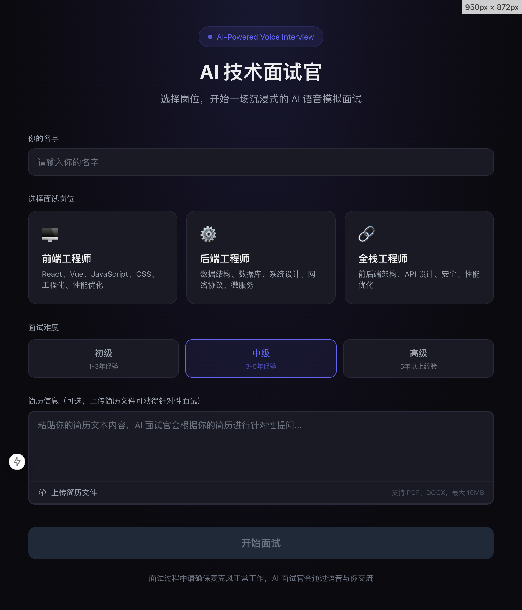
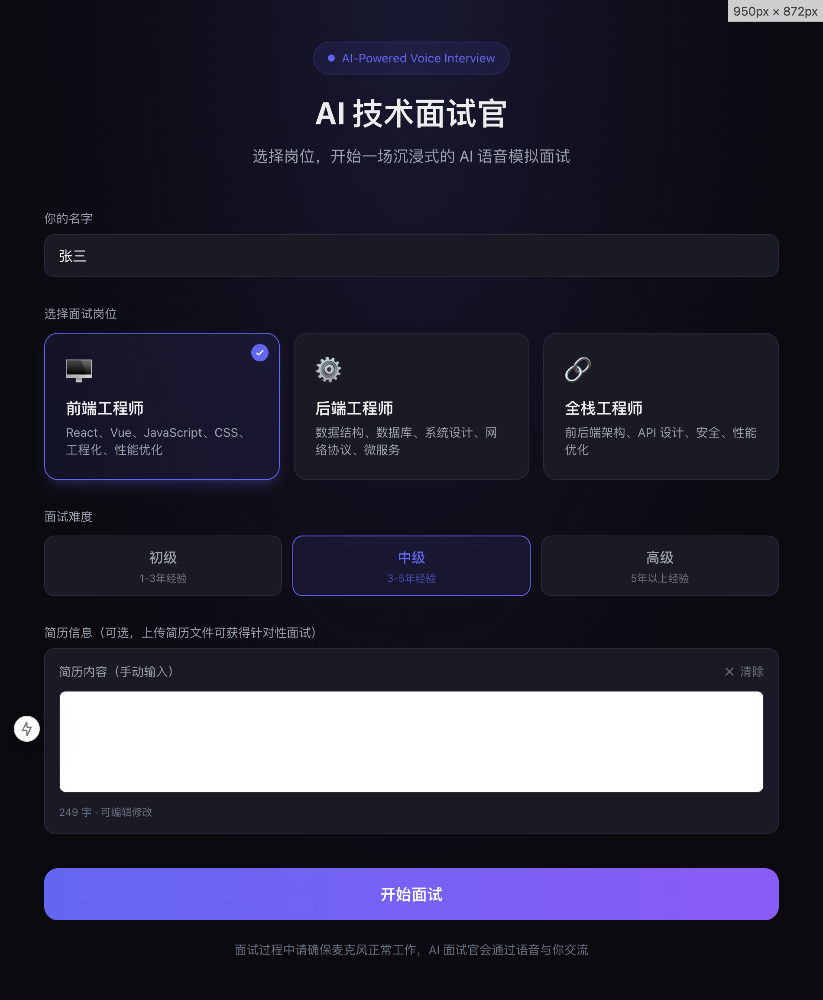
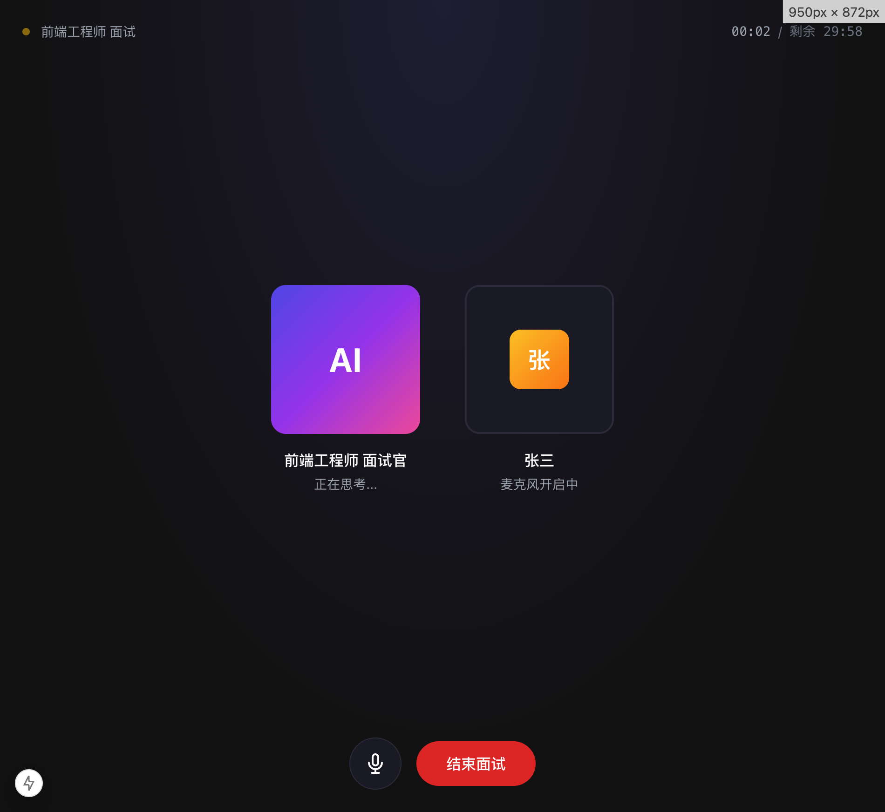
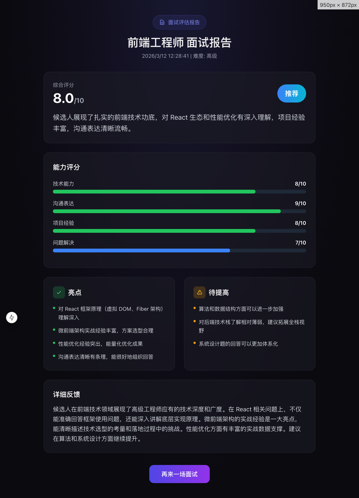

# AI 语音技术面试官

基于 LiveKit 实时音频框架的 AI 语音模拟面试平台。通过 SiliconFlow 提供的 DeepSeek-V3（LLM）、SenseVoiceSmall（语音识别）和 CosyVoice2（语音合成），结合 RAG 知识库检索，实现沉浸式的中文语音技术面试体验。

## 页面预览

| 首页 - 面试配置 | 简历上传预览 |
|:---:|:---:|
|  |  |

| 面试房间 | 面试评估报告 |
|:---:|:---:|
|  |  |

## 功能特性

- **语音实时对话**：基于 WebRTC 的低延迟语音通信，支持 VAD 端点检测
- **三大岗位**：前端工程师 / 后端工程师 / 全栈工程师
- **三级难度**：初级（1-3年）/ 中级（3-5年）/ 高级（5年+）
- **简历针对性提问**：支持粘贴简历文本或上传简历文件（PDF / DOCX），AI 面试官会根据简历内容进行追问
- **简历文件解析**：支持拖拽上传或点击上传 PDF、DOCX 格式简历，自动提取文本内容
- **RAG 知识库**：ChromaDB + bge-large-zh-v1.5 向量检索，覆盖 34 道面试真题
- **结构化评估报告**：面试结束后自动生成包含 4 维评分、亮点、改进点、推荐等级的报告
- **多种结束方式**：点击按钮 / 30 分钟超时 / 语音说"结束面试"

## 技术栈

| 层级 | 技术 |
|------|------|
| 前端 | Next.js 15 + React 19 + Tailwind CSS 3 |
| 实时通信 | LiveKit Server + @livekit/components-react |
| Agent | @livekit/agents (Node.js) + Voice Agent Pipeline |
| 语音识别 | SenseVoiceSmall（SiliconFlow） |
| 大语言模型 | DeepSeek-V3（SiliconFlow） |
| 语音合成 | CosyVoice2-0.5B（SiliconFlow） |
| 向量数据库 | ChromaDB + bge-large-zh-v1.5 |
| 容器编排 | Docker Compose |

## 项目结构

```
interview-agent/
├── frontend/                   # Next.js 前端
│   ├── src/
│   │   ├── app/
│   │   │   ├── page.tsx            # 首页（岗位/难度选择 + 简历上传）
│   │   │   ├── interview/page.tsx  # 面试房间页
│   │   │   ├── report/page.tsx     # 面试报告页
│   │   │   └── api/
│   │   │       ├── token/route.ts       # Token 生成 + Agent 调度 API
│   │   │       └── upload-resume/route.ts  # 简历文件上传解析 API（PDF/DOCX）
│   │   └── components/
│   │       └── InterviewRoom.tsx   # 面试房间核心组件
│   └── .env.local
├── agent/                      # LiveKit Agent
│   ├── src/
│   │   ├── main.ts                 # Agent 入口 + 报告生成
│   │   ├── interview-agent.ts      # 面试 Agent 逻辑
│   │   ├── prompts/
│   │   │   └── interviewer.ts      # 面试官提示词
│   │   ├── rag/
│   │   │   ├── knowledge-base.ts   # ChromaDB 检索
│   │   │   └── embeddings.ts       # 向量嵌入
│   │   ├── scripts/
│   │   │   └── index-knowledge.ts  # 题库索引脚本
│   │   └── knowledge/              # 面试题库 JSON
│   └── .env.local
├── docker-compose.yml          # 服务编排
├── livekit.yaml                # LiveKit Server 配置
├── .env                        # Docker Compose 环境变量
└── DESIGN.md                   # 详细系统设计文档
```

## 快速开始

### 前置要求

- Node.js >= 22
- Docker & Docker Compose
- SiliconFlow API Key（[申请地址](https://siliconflow.cn)）

### 1. 配置环境变量

```bash
# 项目根目录 .env（Docker Compose 使用）
cp .env.example .env
# 编辑 .env，填入你的 SILICONFLOW_API_KEY

# Agent 环境变量
cp agent/.env.local.example agent/.env.local
# 编辑 agent/.env.local，填入你的 SILICONFLOW_API_KEY

# 前端环境变量（本地开发用，默认值即可）
cp frontend/.env.local.example frontend/.env.local
```

### 2. 启动基础服务

```bash
# 启动 LiveKit Server + ChromaDB
docker-compose up -d livekit-server chromadb
```

### 3. 索引面试题库（可选，启用 RAG 需要）

```bash
cd agent
npm install
npm run index-knowledge
```

### 4. 启动 Agent

```bash
cd agent
npm install
npm run dev
```

### 5. 启动前端

```bash
cd frontend
npm install
npm run dev
```

访问 http://localhost:3000 开始面试。

### Docker Compose 一键部署

```bash
# 配置 .env 后一键启动所有服务
docker-compose up -d
```

| 服务 | 端口 | 说明 |
|------|------|------|
| frontend | 3000 | Next.js 前端 |
| livekit-server | 7880 | LiveKit WebSocket |
| chromadb | 8000 | 向量数据库 |
| agent | - | 面试 Agent（无端口暴露） |

## 使用流程

1. 打开首页，输入名字，选择岗位和难度
2. （可选）粘贴简历文本，或上传 PDF / DOCX 简历文件获得针对性提问
3. 点击"开始面试"，允许麦克风权限
4. AI 面试官通过语音与你交流，按面试流程推进
5. 点击"结束面试"或说"结束面试"结束
6. 查看结构化面试评估报告

## 系统设计

详见 [DESIGN.md](./DESIGN.md)
