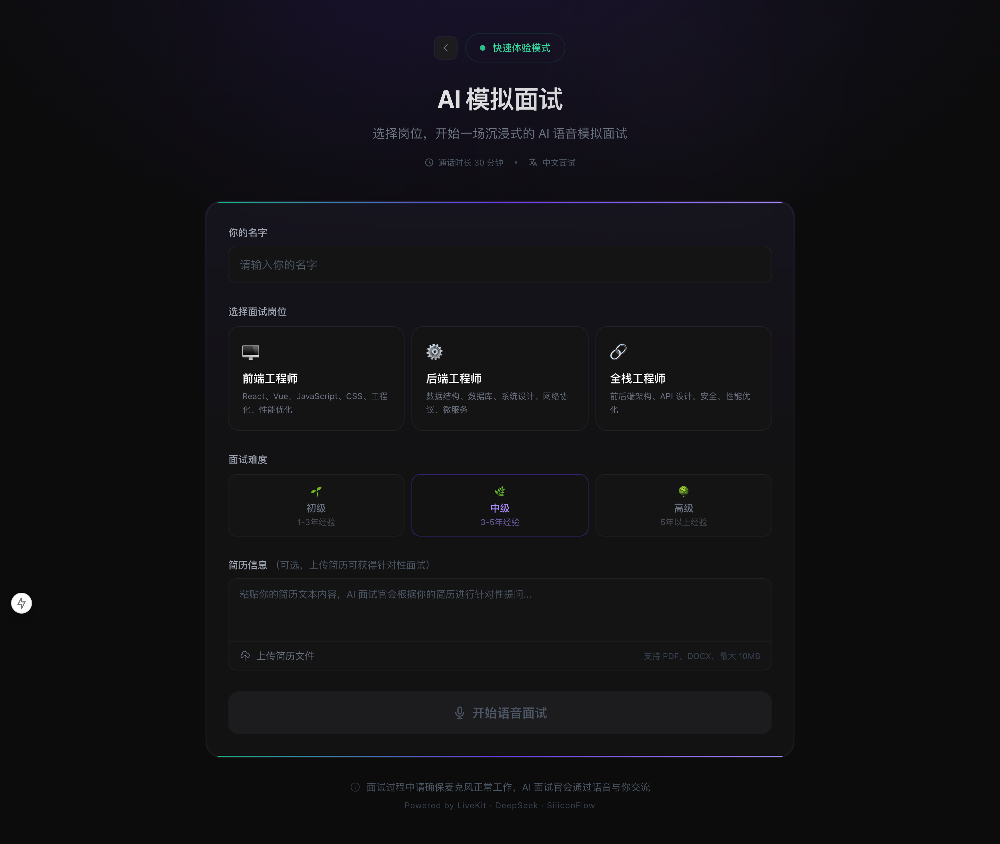
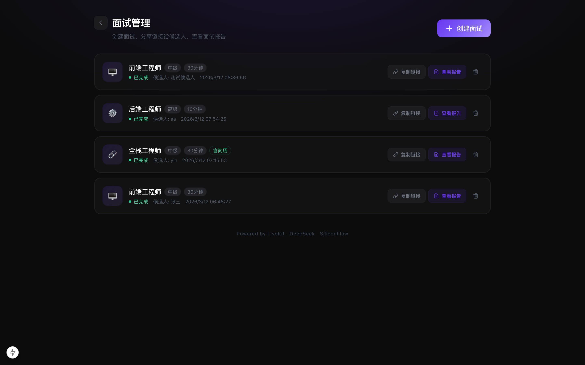
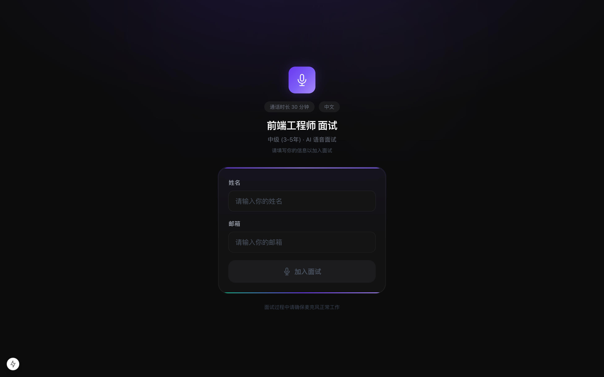
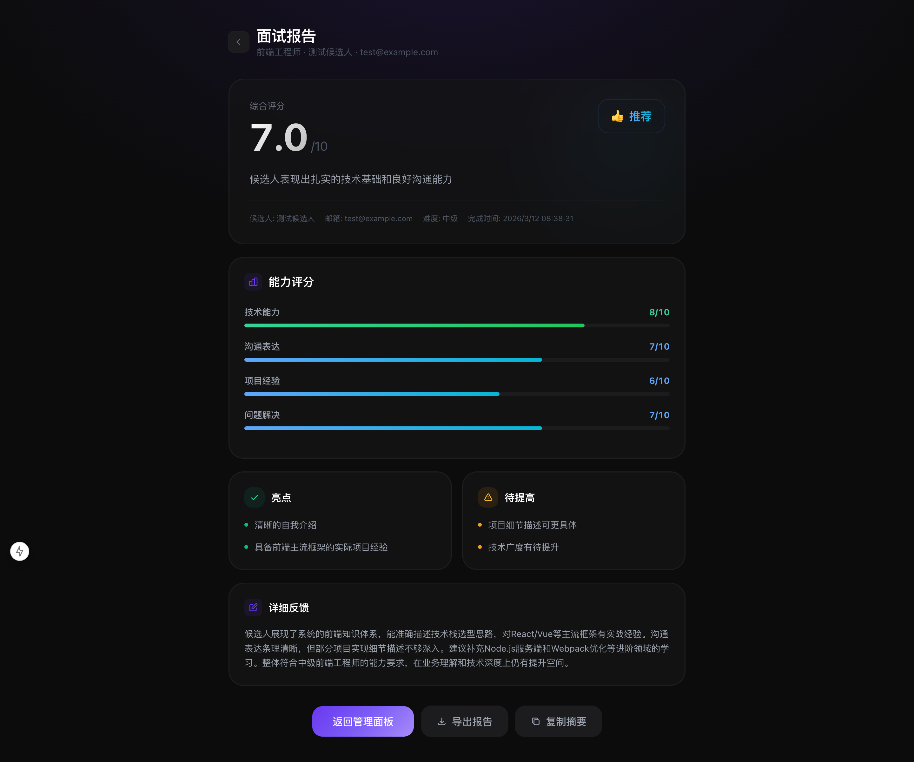
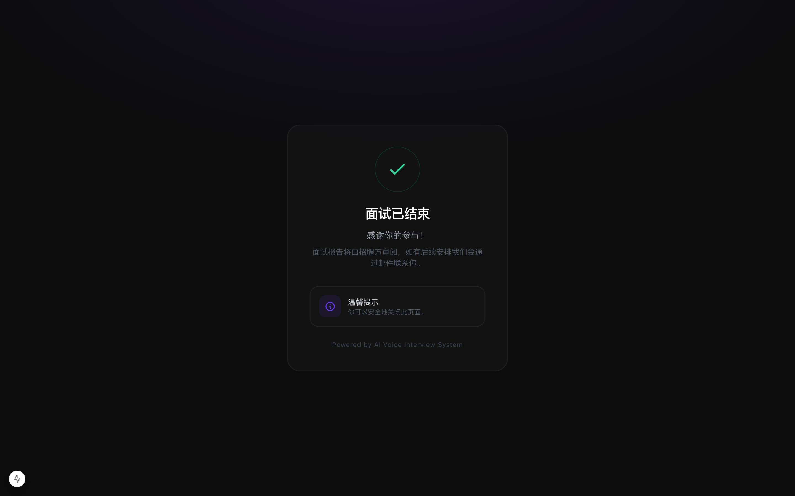

# AI 语音技术面试官

基于 LiveKit 实时音频框架的 AI 语音模拟面试平台。通过 SiliconFlow 提供的 DeepSeek-V3（LLM）、SenseVoiceSmall（语音识别）和 CosyVoice2（语音合成），结合 RAG 知识库检索，实现沉浸式的中文语音技术面试体验。

## 页面预览

| 首页 - 双入口 | 快速体验 - 面试配置 |
|:---:|:---:|
|  |  |

| 招聘者管理面板 | 候选人面试入口 |
|:---:|:---:|
|  |  |

| 面试房间（实时语音 + 转录） | 面试评估报告 |
|:---:|:---:|
|  |  |

| 招聘者查看报告 | 候选人面试完成 |
|:---:|:---:|
|  |  |

## 功能特性

- **双使用模式**：
  - **快速体验模式**：无需注册，直接选择岗位和难度即可开始面试，报告基于 sessionStorage 展示
  - **招聘者模式**：创建面试 → 生成候选人专属链接 → 候选人填写信息加入 → 招聘者查看报告，数据持久化到 SQLite
- **语音实时对话**：基于 WebRTC 的低延迟语音通信，支持 VAD 端点检测
- **实时语音转录**：面试过程中 AI 面试官和候选人的语音实时转为文字，打字机效果逐字显示，支持自动滚动
- **三大岗位**：前端工程师 / 后端工程师 / 全栈工程师
- **三级难度**：初级（1-3年）/ 中级（3-5年）/ 高级（5年+）
- **自定义面试时长**：招聘者模式支持 5-60 分钟自定义时长，面试进度条实时展示
- **简历针对性提问**：支持粘贴简历文本或上传简历文件（PDF / DOCX），AI 面试官会根据简历内容进行追问
- **简历文件解析**：支持拖拽上传或点击上传 PDF、DOCX 格式简历，自动提取文本内容
- **RAG 知识库**：ChromaDB + bge-large-zh-v1.5 向量检索，覆盖 34 道面试真题（前端 17 / 后端 10 / 全栈 4 / 通用 3）
- **结构化评估报告**：面试结束后自动生成包含 4 维评分（技术能力、沟通表达、项目经验、问题解决）、亮点、改进点、推荐等级的报告
- **多种结束方式**：点击按钮 / 超时自动结束 / 语音说"结束面试"
- **报告管理**：支持导出报告（TXT）、复制摘要、招聘者面板查看历史报告
- **候选人管理**：招聘者可创建 / 查看 / 删除面试，面试列表实时刷新状态（等待 / 进行中 / 已完成 / 已过期）

## 技术栈

| 层级 | 技术 |
|------|------|
| 前端 | Next.js 15 + React 19 + Tailwind CSS 3 |
| 实时通信 | LiveKit Server + @livekit/components-react |
| Agent | @livekit/agents (Node.js 22) + Voice Agent Pipeline |
| 语音识别 | SenseVoiceSmall（SiliconFlow） |
| 大语言模型 | DeepSeek-V3（SiliconFlow） |
| 语音合成 | CosyVoice2-0.5B（SiliconFlow） |
| 向量数据库 | ChromaDB + bge-large-zh-v1.5 |
| 业务数据库 | SQLite（better-sqlite3，WAL 模式） |
| 容器编排 | Docker Compose |

## 项目结构

```
interview-agent/
├── frontend/                       # Next.js 前端
│   ├── src/
│   │   ├── app/
│   │   │   ├── page.tsx                # 首页（招聘者入口 + 快速体验双入口）
│   │   │   ├── quick/page.tsx          # 快速体验：岗位/难度选择 + 简历上传
│   │   │   ├── interview/page.tsx      # 快速体验面试房间
│   │   │   ├── report/page.tsx         # 快速体验面试报告（sessionStorage）
│   │   │   ├── recruiter/
│   │   │   │   ├── page.tsx            # 招聘者管理面板（创建/列表/删除）
│   │   │   │   └── report/[id]/page.tsx # 招聘者查看报告
│   │   │   ├── c/[id]/
│   │   │   │   ├── page.tsx            # 候选人信息填写页
│   │   │   │   ├── interview/page.tsx  # 候选人面试房间
│   │   │   │   └── complete/page.tsx   # 面试完成感谢页
│   │   │   └── api/
│   │   │       ├── token/route.ts         # Token 生成 + Agent 调度
│   │   │       ├── interviews/route.ts    # 面试列表/创建 API
│   │   │       ├── interviews/[id]/route.ts # 面试详情/更新/删除 API
│   │   │       └── upload-resume/route.ts # 简历文件解析 API
│   │   ├── components/
│   │   │   └── InterviewRoom.tsx       # 面试房间核心组件
│   │   ├── lib/
│   │   │   ├── db.ts                   # SQLite 数据库操作
│   │   │   └── constants.ts            # 共享常量
│   │   └── types/
│   └── .env.local
├── agent/                          # LiveKit Agent
│   ├── src/
│   │   ├── main.ts                     # Agent 入口 + 报告生成
│   │   ├── interview-agent.ts          # 面试 Agent 逻辑（RAG + 结束检测）
│   │   ├── prompts/
│   │   │   └── interviewer.ts          # 面试官提示词
│   │   ├── rag/
│   │   │   ├── knowledge-base.ts       # ChromaDB 检索
│   │   │   └── embeddings.ts           # 向量嵌入
│   │   ├── scripts/
│   │   │   └── index-knowledge.ts      # 题库索引脚本
│   │   └── knowledge/                  # 面试题库 JSON
│   └── .env.local
├── docker-compose.yml              # 服务编排（4 个服务）
├── livekit.yaml                    # LiveKit Server 配置
├── .env                            # Docker Compose 环境变量
└── DESIGN.md                       # 详细系统设计文档
```

## 快速开始

### 前置要求

- Node.js >= 22
- Docker & Docker Compose
- SiliconFlow API Key（[申请地址](https://siliconflow.cn)）

### 1. 配置环境变量

```bash
# 项目根目录 .env（Docker Compose 使用）
cp .env.example .env
# 编辑 .env，填入你的 SILICONFLOW_API_KEY

# Agent 环境变量
cp agent/.env.local.example agent/.env.local
# 编辑 agent/.env.local，填入你的 SILICONFLOW_API_KEY

# 前端环境变量（本地开发用，默认值即可）
cp frontend/.env.local.example frontend/.env.local
```

### 2. 启动基础服务

```bash
# 启动 LiveKit Server + ChromaDB
docker-compose up -d livekit-server chromadb
```

### 3. 索引面试题库（可选，启用 RAG 需要）

```bash
cd agent
npm install
npm run index-knowledge
```

### 4. 启动 Agent

```bash
cd agent
npm install
npm run dev
```

### 5. 启动前端

```bash
cd frontend
npm install
npm run dev
```

访问 http://localhost:3000 开始面试。

### Docker Compose 一键部署

```bash
# 配置 .env 后一键启动所有服务
docker-compose up -d
```

| 服务 | 端口 | 说明 |
|------|------|------|
| frontend | 3000 | Next.js 前端 |
| livekit-server | 7880 | LiveKit WebSocket |
| chromadb | 8000 | 向量数据库 |
| agent | - | 面试 Agent（无端口暴露） |

## 使用流程

### 快速体验模式

1. 首页点击"快速体验"
2. 输入名字，选择岗位和难度
3. （可选）粘贴简历文本或上传 PDF / DOCX 简历文件
4. 点击"开始面试"，允许麦克风权限
5. AI 面试官通过语音交流，按面试流程推进
6. 点击"结束面试"或说"结束面试"结束
7. 查看结构化面试评估报告，支持导出和复制

### 招聘者模式

1. 首页点击"招聘者入口"进入管理面板
2. 点击"创建面试"，选择岗位、难度、时长，可上传候选人简历
3. 复制生成的面试链接，发送给候选人
4. 候选人打开链接，填写姓名和邮箱后加入面试
5. 面试结束后，招聘者在管理面板查看报告，支持导出和复制摘要

## 系统设计

详见 [DESIGN.md](./DESIGN.md)
